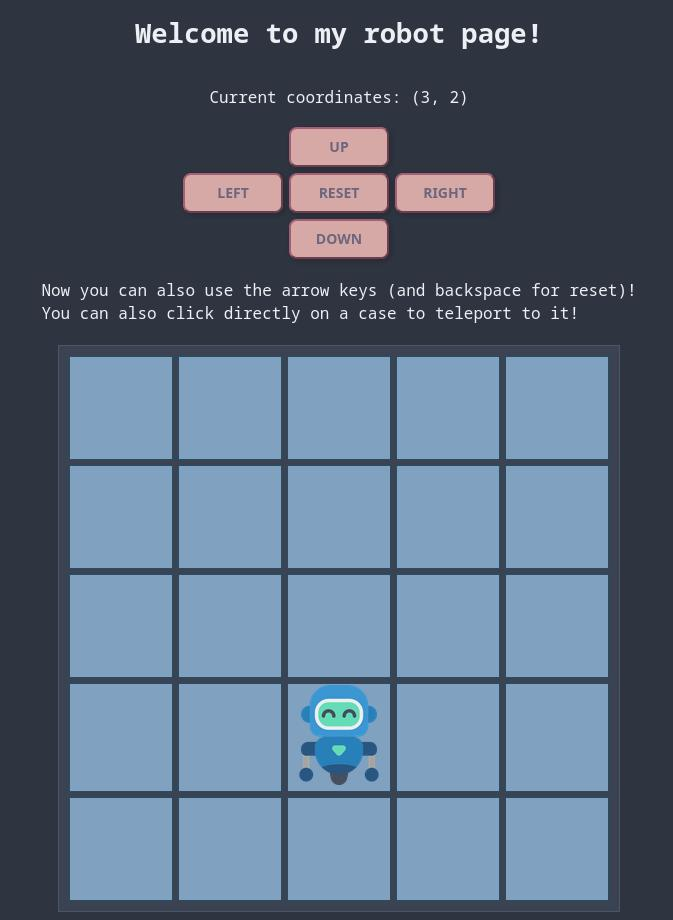

# 🤖 Robot project



## 🌐 Where can I see what it does?

On my website here: [robot.clembytes.fr](https://robot.clembytes.fr)

## ✍️ Where can I follow the process

On my blog here: [clembytes](https://clembytes.fr/)

And more specifically the following articles: [clembytes.fr/category/robot](https://clembytes.fr/category/robot/)

## 💡 The idea

Move a little robot. But it's an excuse for working on basic programming skills. So to add more fun, I am doing it in C, using only the standard library.

**Note:** I am currently [rewriting it in Rust and going a bit further](https://github.com/ClemBytes/rustbot).

## 📁 Project structure

- `server.c` - Server program file
- `test.c` - Units tests file
- `base64.c`, `base64.h` - Base64 encoding implementation in C
- `lib_server.c`, `lib_server.h` - Common functions for server
- `string.c`, `string.h` - Strings implementation in C
- `integration_test.py` - Integration tests in Python of server
- `Makefile` - for make
- `Doxyfile` - for Doxygen documentation
- `data/` - Static files (HTML, CSS, robot PNG image…)
- `data/test_parse/` - Some exemple requests for unit tests
- `docs/` - Documentation generated by Doxygen
- `old/` - Some old programs for trying things…

## ⚙️ Build & run

🧪 Launch tests:
```sh
make tests
```

🚀 Run project:
```sh
make run
```
Then see `127.0.0.0:8000`.

## 📚 Documentation

Generated with [Doxygen](https://www.doxygen.nl/index.html), available [here](https://clembytes.github.io/robot/).

## 💌 Support

You can contact me about this project or my work at <clembytes@proton.me>.

## 🗺️ Roadmap

Here is what I plan to do in the future on this project:
- Use some JavaScript for more interactivity
- Add possibility to write a small list of instructions to follow

## 📈 Project status

Actually [rewriting it in Rust and going further](https://github.com/ClemBytes/rustbot)!